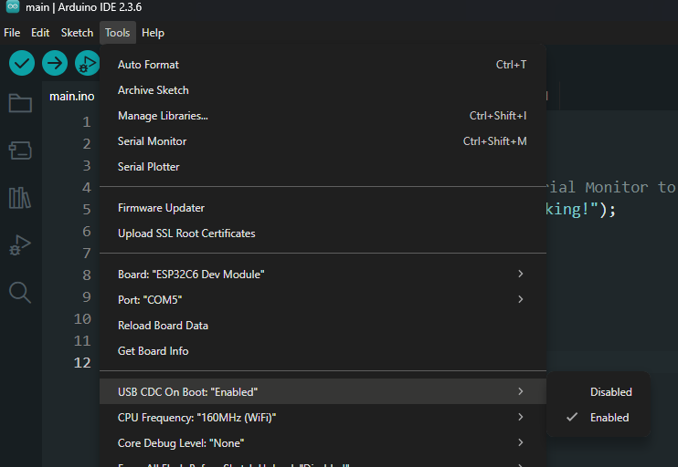

# ESP32-C6 Water Level Monitoring System

Ultrasonic tank-level monitor with 
**A02YYUW sensor**, **SSD1306 OLED**, 
and **NeoPixel RGB LED**, 
featuring WiFi setup and live web dashboard.

##  Features
- **A02YYUW ultrasonic distance sensor** (UART)
- **SSD1306 OLED display** (I²C) for live readings
- **NeoPixel RGB LED** status indicator
- **WiFi setup portal** (AP/STA modes)
- Configurable **full** and **empty** tank distances
- Modular C++/ESP32 code

##  Project Structure

esp32-distance-sensor/
├── README.md
├── main/
│   ├── main.py # Main application
│   ├── A02YYUW.h / A02YYUW.cpp # Ultrasonic sensor driver
│   ├── user-led.h / user-led.cpp # NeoPixel LED control
│   ├── user-screen.h / user-screen.cpp # OLED display module
│   ├── user-wifi.h / user-wifi.cpp # WiFi & web server
└── Libraries/
    └── ...

##  Wiring

### A02YYUW → ESP32-C6

| Sensor Wire | ESP32-C6 Pin |
|-------------|--------------|
| Red (5V)    | 5V           |
| Black (GND) | GND          |
| White (TX)  | GPIO 4       |
| Yellow (RX) | GPIO 5       |

| Sensor Wire | 2 pair cable | DC Barrel Jack | ESP32-C6 Pin |
|-------------|--------------|----------------|--------------|
| Red (5V)    | orange       | Red            | 5V           |
| Black (GND) | brown        | Black          | GND          |
| White (TX)  | blue         | Black          | GPIO 4       |
| Yellow (RX) | green        | Red            | GPIO 5       |

### OLED (SSD1306) → ESP32-C6

| OLED Pin | ESP32-C6 Pin |
|----------|--------------|
| VCC      | 3.3V         |
| GND      | GND          |
| SDA      | GPIO 3       |
| SCL      | GPIO 2       |

### NeoPixel LED → ESP32-C6

| LED Pin | ESP32-C6 Pin |
|---------|--------------|
| Data In | GPIO 8       |
| VCC     | 5V           |
| GND     | GND          |

### Button → ESP32-C6

| Button Pin | ESP32-C6 Pin |
|------------|--------------|
| One side   | GPIO 18      |
| Other side | GND          |

---

## ESP32-C6  Connections

| Source         | Destination         |
|----------------|---------------------|
| 5V             | A02YYUW RED         |
| GND            | A02YYUW BLACK       |
| GND            | SSD1306 GND         |
| GND            | BUTTON 1            |
| GND            | BUTTON 2            |
| 3.3V           | SSD1306 VCC         |
| GPIO 0         | BUTTON              |
| GPIO 3         | SSD1306 I2C_SDA     |
| GPIO 2         | SSD1306 I2C_SCL     |
| GPIO 4         | A02YYUW White       |
| GPIO 5         | A02YYUW Yellow      |
| GPIO 18        | BUTTON 2 LARGE      |

## Screen shot of Webserver:

 ## Photos:

 
 

## don't forget to turn on UART Serial.

## ⚙️ Other Details

- **Cable**: 2-pair, 30 meters
- **DC Inputs**:
  1. 5V power input
  2. RX/TX for UART communication
  3. 5V output to sensor
- **Buttons**:
  - **Power switch**: Turns the device on/off
  - **Screen toggle button**: Turns OLED display on/off
  - **WiFi reset button**: Hold 3 seconds to clear WiFi credentials
  - **Extra button (future use)**: Could be used to control LED or other features
